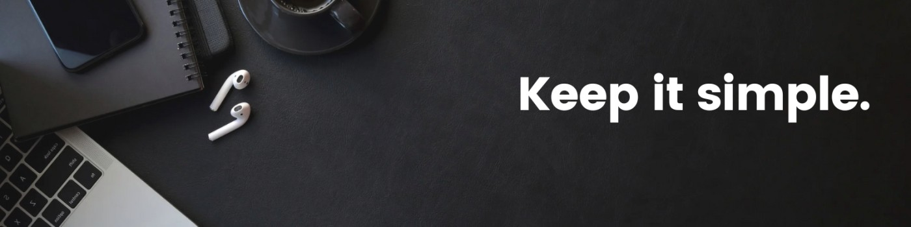

# Hi, I am Wassim 👋  

## 💫 About Me:  
👨‍💻 I'm a 4th year Computer Science student at **ESI Algiers**  
🌱 Currently learning **Machine Learning** & **Mobile Development**  
📫 Feel free to reach me out at **lw_beldjoudi@esi.dz**  

## 🌐 Socials:  
   

---

# 💻 Tech Stack:  

### 🖥️ Programming Languages  
  

### ⚙️ Frameworks & Development Tools  
  

### 🗄️ Databases  
  

### 🔧 DevOps & Testing  
  

### 🎨 UI/UX & Design  
  

### 🛠️ Editors & Software  
  

---

## 🐍 GitHub Contribution Graph  
<picture>
  <source media="(prefers-color-scheme: dark)" srcset="https://raw.githubusercontent.com/mythsSIMOU/mythsSIMOU/output/github-snake-dark.svg" />
  <source media="(prefers-color-scheme: light)" srcset="https://raw.githubusercontent.com/mythsSIMOU/mythsSIMOU/output/github-snake.svg" />
  
</picture>  
